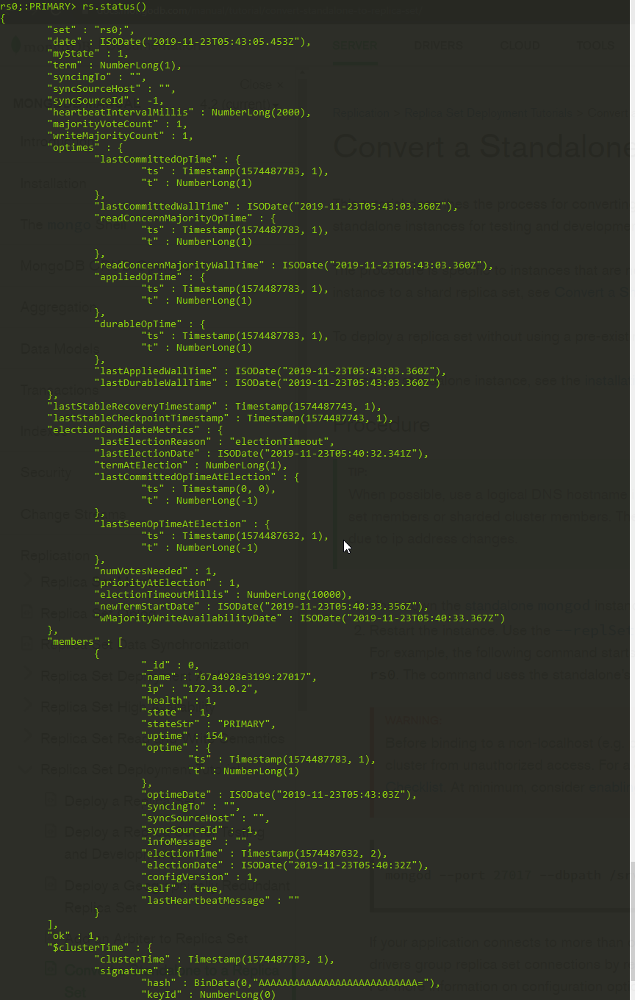

# MongoDb Transaction demo

## Docker Setup

使用 Docker 建立單體的 mongodb replica set instance 來測試 transaction 模式，
此練習目標是建立可使用 transaction 的 mongodb instance 故只建立一個 instance。

### 將 Standalone 轉成 Replica Set

建立 mongodb_scripts 目錄，並在下面放置 `mongodb_scripts/init.sh` 讓 mongoClient 執行並設定 mongoTest 為 replica set 模式。

docker-compose.yml

```yml
  mongoTest:
    image: mongo
    container_name: mongoTest
    ports:
      - "27017:27017"
    entrypoint: [ "mongod", "--bind_ip_all", "--replSet", "rs0;" ]
  mongoClient:
    image: mongo
    container_name: mongoClient
    links:
      - mongoTest
    volumes:
      - ./mongodb_scripts:/deployment_scripts
    command:
      - /deployment_scripts/init.sh
    depends_on:
      - mongoTest
```

`mongodb_scripts/init.sh`

```sh
mongo --host mongoTest --port 27017 --eval "rs.initiate()"
```

執行 `docker-compose up -d` 即會建立一個 Replica Set 的 Primary mongodb instance。

進入該 docker container 確認狀態。

`docker exec -it mongoTest mongo`

`rs.status()`

Status 顯示出該 state 及 member，會看到只有自己一個成員並且是 PRIMARY 表示已成功設定。



## C# MongoDb transaction

以下為實作範例及測試程式。

```C#
public class MongoDbRepository
{
    public readonly MongoClient Connection;
    private const string ConnectionString = "mongodb://127.0.0.1:27017/TestDB";
    private const string DatabaseName = "TestDB";
    private const string CollectionName = "Users";
    private IClientSessionHandle _session;

    public MongoDbRepository()
    {
        Connection = new MongoClient(ConnectionString);
    }

    public void SetSession(IClientSessionHandle session)
    {
        _session = session;
    }

    public void InsertUser(UserEntity user)
    {
        var collection = GetUserCollection();
        collection.InsertOne(_session, user);
    }

    private IMongoDatabase GetDatabase() => _session != null ? _session.Client.GetDatabase(DatabaseName) : Connection.GetDatabase(DatabaseName);

    private IMongoCollection<UserEntity> GetUserCollection() =>
        GetDatabase().GetCollection<UserEntity>(CollectionName);
}
```

```C#

[Test]
public async Task Transaction_InsertUser_should_success()
{
    var sut = _dbRepository;
    var user = _userGenerator.Generate();

    using (var session = await _dbRepository.Connection.StartSessionAsync())
    {
        sut.SetSession(session);
        session.StartTransaction();

        Assert.DoesNotThrow(() => sut.InsertUser(user));

        await session.CommitTransactionAsync();
    }
    var inserted = sut.FindUsers(user.Id).Single();

    Assert.IsNotNull(inserted);
}

[Test]
public async Task Transaction_InsertUser_should_rollback()
{
    var sut = _dbRepository;
    var user = _userGenerator.Generate();

    using (var session = await _dbRepository.Connection.StartSessionAsync())
    {
        sut.SetSession(session);
        session.StartTransaction();

        Assert.DoesNotThrow(() => sut.InsertUser(user));

        await session.AbortTransactionAsync();
    }
    var inserted = sut.FindUsers(user.Id).Any();

    Assert.IsFalse(inserted);
}
```
